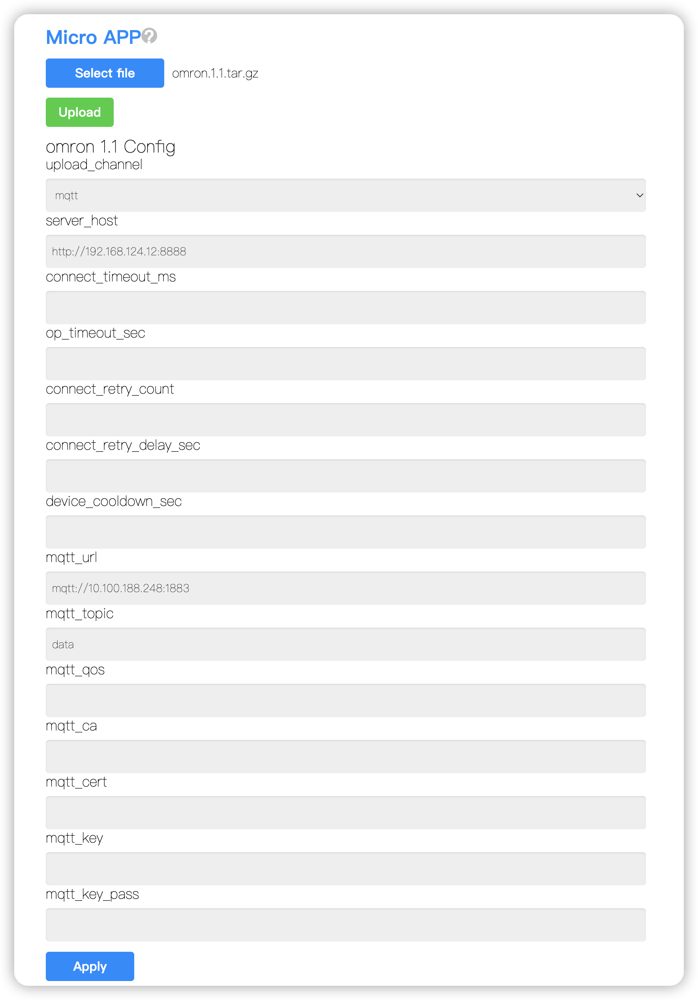
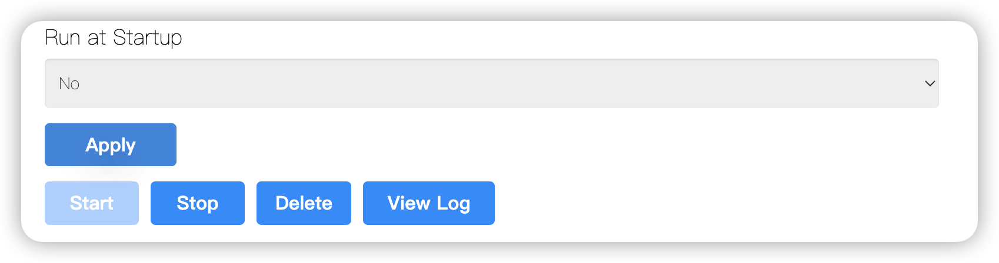

# Omron M2000 Blood Pressure Gateway App

This app runs on a Cassia gateway, scans for BLE Blood Pressure Service advertisements, connects to matching Omron blood pressure monitors, enables indication on the Blood Pressure Measurement characteristic, parses the standard BLE payload, and uploads the parsed result by HTTP(S), MQTT(S), both, or neither.

## Files

- `main.py`: runtime application code.
- `meta.json`: app metadata and configurable runtime options.
- `build.sh`: package build script.
- `test_parse.py`: local parser sample for a standard BLE blood pressure payload.
- `test_parse_ts.py`: timestamp fallback test.

## Package

Run the build script from the repository root:

```bash
./build.sh
```

The script reads `name` and `version` from `meta.json` and creates:

```text
omron.1.1.tar.gz
```

The package contains `main.py` and `meta.json`.

## Install

Install the generated `.tar.gz` package with your Cassia gateway app management workflow.

Typical install flow:

1. Build the package with `./build.sh`.
2. Upload `omron.1.1.tar.gz` to the gateway or gateway management portal.
3. Install or upgrade the app in the app management page.

The exact upload and install steps depend on the Cassia gateway management environment used by your deployment.

Gateway upload and configuration screen:



## App Management

Use the gateway app management page to install, configure, start, stop, delete, and inspect the app.

Recommended management flow:

1. Install the app package.
2. Configure the app only as needed.
3. Start the app. Optionally enable `Run at Startup` before starting.
4. Get the runtime result from the configured upload channel or from logs.

Optional operations:

- Stop app: click `Stop` to stop scanning, BLE connection handling, and uploads.
- Delete app: click `Delete` when the app is no longer needed.
- Debug log: click `View Log` and check scanning, connection, parsing, HTTP upload, and MQTT publish messages.

App runtime controls placeholder:



## Run

After the app starts, it:

1. Reads user configuration with `cassiasys.read_user_config()`.
2. Starts BLE scanning for Blood Pressure Service advertisements.
3. Creates one task per target device, while serializing the full BLE connection session to avoid gateway `busy` connection responses.
4. Connects to the device with the configured connection timeout.
5. Writes `0x0200` to CCCD handle `2066` to enable indications.
6. Waits for blood pressure indications.
7. After the first indication, writes the current local time to handle `1297`.
8. Keeps the BLE session open until no new data arrives for `data_idle_timeout_sec`.
9. Parses and uploads each received result.
10. Disconnects and clears per-device state.

Useful log lines:

```text
Scanner started
Found target BP monitor: <mac>
Connecting <mac> attempt 1/3...
[RESULT] Device <mac>: Sys 132, Dia 73, MAP 92, Pulse 76, User 1, Status 0
HTTP push status: 200
MQTT publish successful 1
```


## Configuration

All configuration values are optional. Defaults are defined in `main.py`.

| Name | Default | Description |
| --- | --- | --- |
| `upload_channel` | `http` | Upload mode: `http`, `mqtt`, `both`, or `none`. |
| `server_host` | `http://127.0.0.1:8000` | HTTP or HTTPS endpoint used when `upload_channel` is `http` or `both`. |
| `connect_timeout_ms` | `5000` | BLE connection timeout in milliseconds. |
| `op_timeout_sec` | `10` | Time to wait for measurement data after enabling indications. |
| `data_idle_timeout_sec` | `3` | Time to keep the connection open after the latest received indication. Increase this if the device sends several records slowly. |
| `connect_retry_count` | `3` | Number of connection attempts. Values below `1` are treated as `1`. |
| `connect_retry_delay_sec` | `2` | Delay before retrying a `busy` or in-progress connection response. |
| `device_cooldown_sec` | `15` | Minimum time before the same device can be processed again. |
| `current_time_timezone_offset_min` | empty | Optional timezone offset in minutes used only for Current Time writes. Leave empty to use gateway local time. Set `480` for UTC+8 when the gateway clock returns UTC. |
| `mqtt_url` | empty | MQTT or MQTTS broker URI, for example `mqtt://host:1883` or `mqtts://host:8883`. Required for MQTT upload. |
| `mqtt_topic` | `omron/blood_pressure` | MQTT topic for parsed result upload. |
| `mqtt_qos` | `1` | MQTT publish QoS. |
| `mqtt_publish_retry_count` | `3` | Maximum publish attempts for one cached payload before dropping it. |
| `mqtt_publish_retry_delay_sec` | `5` | Delay before retrying a failed MQTT publish. |
| `mqtt_ca` | empty | CA certificate path or value accepted by `CassiaMQTTClient`. |
| `mqtt_cert` | empty | Client certificate path or value accepted by `CassiaMQTTClient`. |
| `mqtt_key` | empty | Client private key path or value accepted by `CassiaMQTTClient`. |
| `mqtt_key_pass` | empty | Client private key password. |

Example HTTP(S) configuration:

```json
{
  "upload_channel": "http",
  "server_host": "https://example.com/api/blood-pressure",
  "connect_timeout_ms": "5000",
  "op_timeout_sec": "10",
  "data_idle_timeout_sec": "3",
  "current_time_timezone_offset_min": "480"
}
```

Example MQTT(S) configuration:

```json
{
  "upload_channel": "mqtt",
  "mqtt_url": "mqtts://broker.example.com:8883",
  "mqtt_topic": "omron/blood_pressure",
  "mqtt_qos": "1",
  "mqtt_ca": "/path/to/ca.pem",
  "mqtt_cert": "/path/to/client.crt",
  "mqtt_key": "/path/to/client.key",
  "mqtt_key_pass": ""
}
```

Example dual upload configuration:

```json
{
  "upload_channel": "both",
  "server_host": "https://example.com/api/blood-pressure",
  "mqtt_url": "mqtts://broker.example.com:8883",
  "mqtt_topic": "omron/blood_pressure"
}
```

## Result Format

Parsed measurements are uploaded as JSON objects.

Example parsed result for BLE payload `1E840049005C00000000000000004C00010000`:

```json
{
  "mac": "AA:BB:CC:DD:EE:FF",
  "flags": 30,
  "systolic": 132,
  "diastolic": 73,
  "map": 92,
  "pulse": 76,
  "unit": "mmHg",
  "ts": 1710000000,
  "user_id": 1,
  "measurement_status": 0
}
```

Field notes:

- `flags`: raw BLE Blood Pressure Measurement flags byte.
- `systolic`, `diastolic`, `map`: integer blood pressure values.
- `pulse`: pulse rate if present, otherwise `0`.
- `unit`: `mmHg` by default. kPa values are converted to mmHg.
- `ts`: gateway Unix timestamp. Device timestamps are logged but not trusted.
- `user_id`: BLE User ID if present, otherwise `null`.
- `measurement_status`: standard BLE measurement status bit field if present, otherwise `null`.

## Local Validation

Run syntax checks:

```bash
python3 -m py_compile main.py test_parse.py test_parse_ts.py
```

Run the parser sample. The current sample payload in `test_parse.py` is `1E710048005500000000000000004F00010000`.

```bash
python3 test_parse.py
```

Expected output:

```text
Flags: 1E
Sys: 113
Dia: 72
MAP: 85
Pulse: 79
User ID: 1
Measurement status: 0
```
