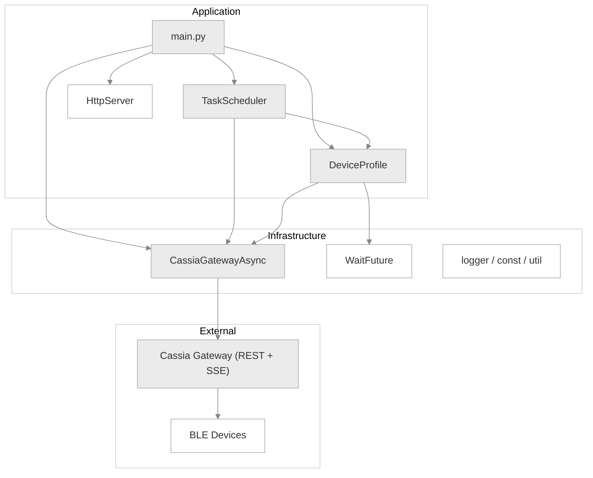
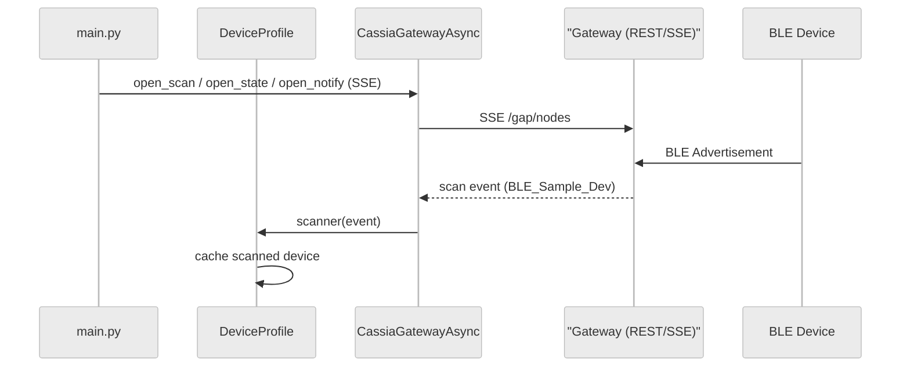
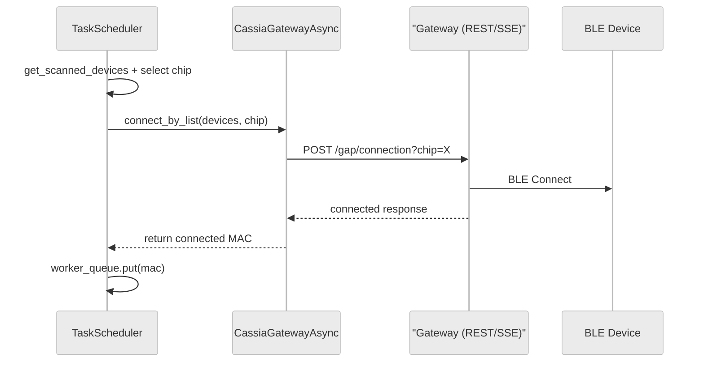
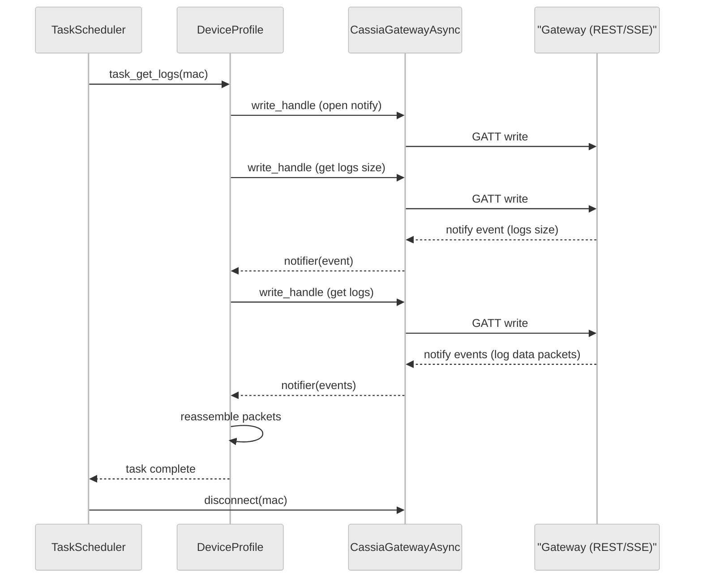

# Connection by List Example

A Python asyncio application that demonstrates **batch BLE device connection** using the Cassia Gateway REST API with **connect-by-list** (synchronous list-based connection). It scans for BLE devices via SSE, schedules connections across dual chips with priority-based queuing, retrieves device logs over GATT, and exposes a lightweight HTTP API for monitoring.

## Architecture



## Sequence Diagrams

### Phase 1: Scan



### Phase 2: Connect



### Phase 3: Data Retrieval



## File Reference

### Core Files

| File | Description |
|------|-------------|
| `main.py` | Async entry point. Wires up gateway, device profile, task scheduler, and HTTP server, then runs all tasks via `asyncio.gather`. |
| `gateway.py` | Cassia Gateway client wrapping REST API (`aiohttp`) and SSE streams (`aiohttp-sse-client`). Handles scan, connection-state, and notification SSE with auto-reconnect. Also includes additional API examples (connect_batch, update_phy, etc.) not used in the main flow. |
| `device_profile.py` | BLE device GATT protocol implementation. Parses scan advertisements, manages GATT notify/write for log retrieval, and reassembles fragmented log packets. |
| `task.py` | Dual-chip connection scheduler. Selects chip and devices based on priority, calls `connect_by_list`, dispatches connected devices to an async worker queue for log retrieval. |
| `wait.py` | Async Future with periodic timeout checker. Pairs GATT write requests with notification responses. |
| `http_server.py` | Lightweight `aiohttp.web` server exposing health check (`/api/health`) and task/test status endpoints. |
| `logger.py` | Console logger with asyncio task name in log format. |
| `const.py` | Enum definitions: `TaskPriority`, `DeviceType`, `TaskState`, `ChipId`. |
| `util.py` | Timestamp helper functions. |

### Test / Tool Files

These files are **not required for production**. They provide a testing framework that drives the main application with a predefined device list and visualizes results.

| File | Description |
|------|-------------|
| `test_devices.py` | Manages a test device list loaded from JSON. Overrides scanned device priorities, tracks task completion across priority transitions (HIGH -> MEDIUM -> LOW), saves history, and optionally renders results. |
| `scan_test_devices.py` | Standalone script. Scans for `BLE_Sample_Dev` devices for 5 seconds and writes discovered MACs to `test_devices.json`. |
| `render_history_json.py` | Reads a history JSON file and generates Plotly HTML charts: an info table with per-chip statistics and a task timeline chart. |
| `test_devices.json` | Sample test device configuration (MAC addresses with priority and device type). |

## Quick Start

### Prerequisites

```bash
pip3 install aiohttp aiohttp-sse-client aiofiles
```

For test result visualization (optional, install on your **local machine** rather than in containers due to large package size):

```bash
pip3 install plotly pandas
```

### Run (Normal Mode)

```bash
BASE_URL=http://<GatewayIP> python3 main.py
```

### Run (Test Mode)

1. Generate a test device list by scanning:

```bash
BASE_URL=http://<GatewayIP> python3 scan_test_devices.py
```

2. Run with the test file:

```bash
BASE_URL=http://<GatewayIP> TEST_FILE=./test_devices.json python3 main.py
```

> **Note:** In test mode, history files are saved to `../result/`. Make sure this directory exists before running.

### Render Test Results

```bash
python3 render_history_json.py ../result/test_devices_history_<timestamp>.json
```

## Environment Variables

| Variable | Default | Description |
|----------|---------|-------------|
| `BASE_URL` | `http://10.10.10.254` | Cassia Gateway URL |
| `WORKER_NUM` | `2` | Number of concurrent worker coroutines |
| `TEST_FILE` | *(none)* | Path to test device JSON file. If unset, test mode is disabled. |
| `TEST_ROUND` | `1` | Number of test rounds. `0` = repeat indefinitely. |
| `LOG_LEVEL` | `INFO` | Log level (`DEBUG`, `INFO`, `WARNING`, `ERROR`, `CRITICAL`) |

## HTTP API Endpoints

| Endpoint | Description |
|----------|-------------|
| `GET /api/health` | Health check, returns `OK` |
| `GET /api/tasks/state` | Current task states for all devices |
| `GET /api/tests/devices/state` | Test device states (test mode only) |
| `GET /api/tests/devices/raw` | Raw test device JSON (test mode only) |
| `GET /api/tests/history` | Test run history (test mode only) |
